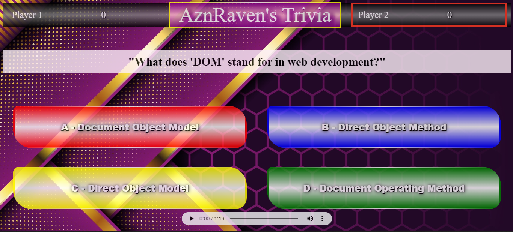

# AznRaven's Trivia: A CSS, JS, and HTML Game
Welcome to AznRaven's Trivia, a two-player game where players can test their knowledge of CSS, JS, and HTML. The game features an intuitive design, randomized player turns, and a challenging set of questions to keep players engaged and learning.

Github Pages [AznRaven's Trivia](https://aznraven.github.io/Trivia/) <== Click To Play

## How to Play
The game begins with a randomized player turn, indicated by a red border.
Players will be presented with questions related to CSS, JS, and HTML.
When a player selects an answer, the selected choice will show a green border if correct, along with a success chime. If the answer is incorrect, the selected choice will have a red border with the correct answer highlighted in green, accompanied by a fail chime.
The game continues until all questions have been answered.
The player with the most points at the end of the game wins.
Start playing now and see how much you know about CSS, JS, and HTML!

